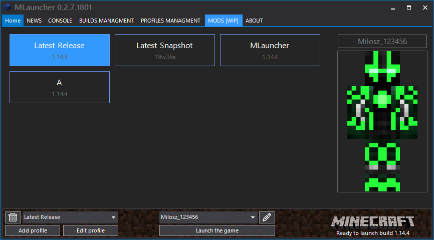

# MLauncher    

This is open source unofficial Minecraft launcher, based on dotMCLauncher and FreeLauncher. Feel free to contibute.

Requires **.NET Framework 4.7.2**

## Third-party assemblies used in this software

* FreeLauncher                     - https://github.com/dedepete/FreeLauncher
* Telerik RadControls for WinForms - http://www.telerik.com/products/winforms.aspx
* JSON.NET                         - http://james.newtonking.com/json
* DotNetZip                        - https://github.com/haf/DotNetZip.Semverd
* CommandLineParser                - https://github.com/gsscoder/commandline
